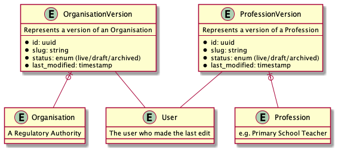
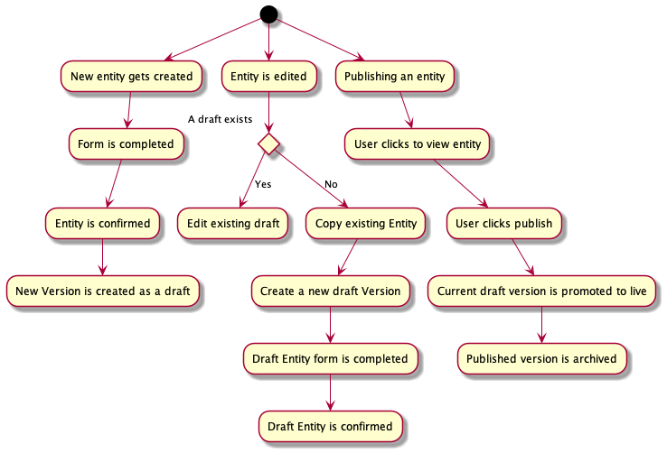

# 14. manage-versioning-with-a-versions-table

Date: 2022-01-18

## Status

Accepted

## Context

We need to be able to manage versioning of entities (namely Organisations and Professions) in order
that content can be reviewed and history tracked.

There is an [existing library available for TypeORM] that supports versioning and change tracking,
however it seems to create new versions of entities on every save, which given we carry out multiple
saves when creating/updating professions, won't really work for our use case.

## Decision

With this in mind, we propose a solution where we have two tables to version Organisation and
Profession entities, each with the following fields:

- Slug
- Entity ID
- User ID (The ID of the user who created the version)
- Status (live/draft/archived)

This will allow us to create copies of entities, and link them together via the Versions table.

When a new Entity is created, we create a draft Version and link it to the Entity at the end of
the create journey.

When a live Entity is edited, we create a copy of the entity and attach a new draft Version at
the start of the journey.

When a draft Entity is published, we change the currently live version's status to Archived and
change the draft Entity's Version status to Live.

When searching for or listing entities, we only show live version on the public side. On the
admin side, we only list the latest live/draft version.

The flow can be illustrated with the following diagram:

## Consequences

This will mean that users will be able to see at a glance what is live and what is in draft. It
will also give an audit trail of what users have done and when.

There is a risk that we will flood the database with extra Organisations and Professions, but
given database storage is cheap and we don't expect tens of thousands of records, this is not
a huge concern.

[1]: https://github.com/frane/typeorm-versions
