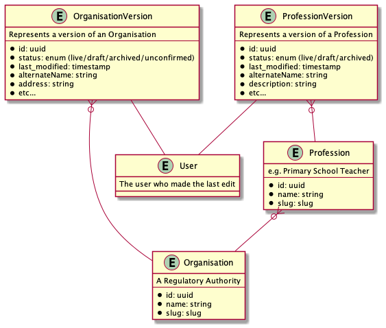
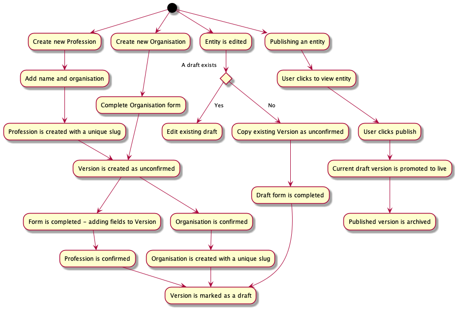

# 15. use-versions-to-store-versioned-entity-data

Date: 2022-01-25

## Status

Accepted

## Context

In [#14](./0014-manage-versioning-with-a-versions-table.md) we proposed managing versions of
versioned entities (namely, Organisations and Professions) with their own Version tables. Since
starting to implement this, we've encountered a problem where copying entities will mean we
will no longer be able to index slugs uniquely, causing us problems when we try and create
new entities and fetch entities by slug.

## Decision

With this in mind, we will iterate the data model to store the majority of an entity's
information in the version table itself, with the name of the entity and the slug (as well
as a reference to an organisation in the case of professions) in the entity table like so:

With this in place, the flow of how versions are created changes slightly too:

Because Organisations are created on one page, we can create the Organisation table and
the Version at the same time

## Consequences

This means we will be able to uniquely index on slugs without having to remove the index
so we can copy entities. It will also make it much easier to get the latest version for an
entity (for example, they can have a `#latest_version` and `#latest_draft` method).

This does however mean that we will have to make sure that names cannot be edited once they
have been created, but given we ideally want slugs to be immutable, this makes things a bit
tidier. We'll need to make sure longer term that we make it clear to users that they'll
need to add a new Entity if a name changes.

This will also involve a bit of work moving the fields to the version table, but I think
this is a fair trade off, given how much tidier this approach is.
